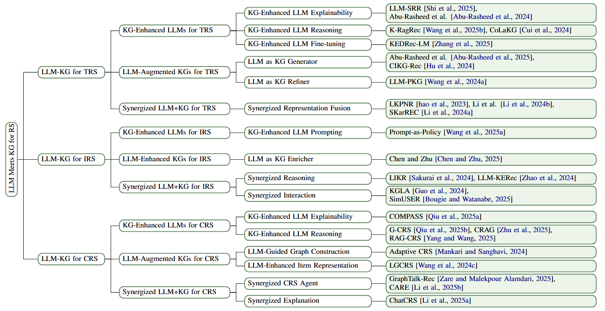

# Awesome-llm-kg-recsys

## Taxonomy

---

## Paper List

### 1) TRS

#### 1.1 KG-Enhanced LLMs for TRS

**(a) KG-Enhanced LLM Explainability**

1. **LLM-powered explanations: Unraveling recommendations through subgraph reasoning**  

   Shi et al., *Knowledge-Based Systems*, 2025. [publisher](https://www.sciencedirect.com/science/article/abs/pii/S0950705125013486) | [pdf](paper/01_shi_2025_llm_powered_explanations_unraveling_recommendations_through_subgraph_reasoning.pdf)

2. **Knowledge Graphs as Context Sources for LLM-Based Explanations of Learning Recommendations**  

   Abu-Rasheed et al., arXiv, 2024. [arxiv](https://arxiv.org/abs/2403.03008) | [pdf](paper/02_abu_rasheed_2024_knowledge_graphs_as_context_sources_for_llm_based_explanations_of_learning_recommendations.pdf)

**(b) KG-Enhanced LLM Reasoning**

1. **Knowledge Graph Retrieval-Augmented Generation for LLM-based Recommendation (K-RagRec)**  

   Wang et al., *ACL (Long)*, 2025. [acl](https://aclanthology.org/2025.acl-long.1317/) | [pdf](paper/03_wang_2025_k_ragrec_knowledge_graph_retrieval_augmented_generation_for_llm_based_recommendation.pdf)

2. **Comprehending Knowledge Graphs with Large Language Models for Recommender Systems (CoLaKG)**  

   Cui et al., arXiv, 2024. [arxiv](https://arxiv.org/abs/2410.12229) | [pdf](paper/04_cui_2024_colakg_comprehending_knowledge_graphs_with_large_language_models_for_recommender_systems.pdf)

**(c) KG-enhanced LLM Fine-tuning**

1. **KEDRec-LM: A Knowledge-distilled Explainable Drug Recommendation Large Language Model**  

   Zhang et al., arXiv, 2025. [arxiv](https://arxiv.org/abs/2502.20350) | [pdf](paper/05_zhang_2025_kedrec_lm_a_knowledge_distilled_explainable_drug_recommendation_large_language_model.pdf)

---

#### 1.2 LLM-Augmented KGs for TRS

**(a) LLM as KG Generator**

1. **LLM-Assisted Knowledge Graph Completion for Curriculum and Domain Modelling in Personalized Higher Education Recommendations**  

   Abu-Rasheed et al., arXiv, 2025. [arxiv](https://arxiv.org/abs/2501.12300) | [pdf](paper/06_abu_rasheed_2025_llm_assisted_knowledge_graph_completion_for_curriculum_and_domain_modelling_in_personalized_higher_education_recommendations.pdf)

2. **Bridging the User-side Knowledge Gap in Knowledge-aware Recommendations with Large Language Models (CIKG-Rec)**  

   Hu et al., arXiv, 2024. [arxiv](https://arxiv.org/abs/2412.13544) | [pdf](paper/07_hu_2024_cikg_rec_bridging_the_user_side_knowledge_gap_in_knowledge_aware_recommendations_with_large_language_models.pdf)

**(b) LLM as KG Refiner**

1. **Enabling Explainable Recommendation in E-commerce with LLM-powered Product Knowledge Graph (LLM-PKG)**  

   Wang et al., arXiv, 2024. [arxiv](https://arxiv.org/abs/2412.01837) | [pdf](paper/08_wang_2024_llm_pkg_enabling_explainable_recommendation_in_e_commerce_with_llm_powered_product_knowledge_graph.pdf)

---

#### 1.3 Synergized LLM+KG for TRS

**(a) Synergized Representation Fusion**

1. **LKPNR: LLM and KG for Personalized News Recommendation Framework**  

   Chen et al., arXiv, 2023. [arxiv](https://arxiv.org/abs/2308.12028) | [pdf](paper/09_chen_2023_lkpnr_llm_and_kg_for_personalized_news_recommendation_framework.pdf)

2. **Evaluating Embeddings from Pre-Trained Language Models and Knowledge Graphs for Educational Content Recommendation**  

   Li et al., *Future Internet*, 2024. [publisher](https://www.mdpi.com/1999-5903/16/1/12) | [pdf](paper/10_li_2024_evaluating_embeddings_from_pre_trained_language_models_and_knowledge_graphs_for_educational_content_recommendation.pdf)

3. **Learning Structure and Knowledge Aware Representation with Large Language Models for Concept Recommendation (SKarREC)**  

   Li et al., arXiv, 2024. [arxiv](https://arxiv.org/abs/2405.12442) | [pdf](paper/11_li_2024_learning_structure_and_knowledge_aware_representation_with_large_language_models_for_concept_recommendation_skarrec.pdf)

---

### 2) IRS

#### 2.1 KG-Enhanced LLMs for IRS

**(a) KG-Enhanced LLM Prompting**

1. **Do We Really Need SFT? Prompt-as-Policy over Knowledge Graphs for Cold-start Next POI Recommendation (Prompt-as-Policy)**  

   Wang et al., arXiv, 2025. [arxiv](https://arxiv.org/abs/2510.08012) | [pdf](paper/12_wang_2025_do_we_really_need_sft_prompt_as_policy_over_knowledge_graphs_for_cold_start_next_poi_recommendation.pdf)

---

#### 2.2 LLM-Enhanced KGs for IRS

**(a) LLM as KG Enricher**

1. **Personalized Learning Resource Recommendation Framework Based on Knowledge Graph and Large Language Model**  

   Chen & Zhu, Springer (*Knowledge Science, Engineering and Management*), 2025. [publisher](https://link.springer.com/chapter/10.1007/978-981-95-3001-4_17) | [pdf](paper/13_chen_zhu_2025_personalized_learning_resource_recommendation_framework_based_on_knowledge_graph_and_large_language_model.pdf)

---

#### 2.3 Synergized LLM+KG for IRS

**(a) Synergized Reasoning**

1. **LLM is Knowledge Graph Reasoner: LLM's Intuition-aware Knowledge Graph Reasoning for Cold-start Sequential Recommendation (LIKR)**  

   Sakurai et al., arXiv, 2024. [arxiv](https://arxiv.org/abs/2412.12464) | [pdf](paper/14_sakurai_2024_likr_llm_is_knowledge_graph_reasoner_llms_intuition_aware_knowledge_graph_reasoning_for_cold_start_sequential_recommendation.pdf)

2. **Breaking the Barrier: Utilizing Large Language Models for Industrial Recommendation Systems through an Inferential Knowledge Graph (LLM-KERec)**  

   Zhao et al., arXiv, 2024. [arxiv](https://arxiv.org/abs/2402.13750) | [pdf](paper/15_zhao_2024_llm_kerec_breaking_the_barrier_utilizing_large_language_models_for_industrial_recommendation_systems_through_an_inferential_knowledge_graph.pdf)

**(b) Synergized Interaction**

1. **Knowledge Graph Enhanced Language Agents for Recommendation (KGLA)**  

   Guo et al., arXiv, 2024. [arxiv](https://arxiv.org/abs/2410.19627) | [pdf](paper/16_guo_2024_kgla_knowledge_graph_enhanced_language_agents_for_recommendation.pdf)

2. **SimUSER: Simulating User Behavior with Large Language Models for Recommender System Evaluation**  

   Bougie & Watanabe, arXiv, 2025. [arxiv](https://arxiv.org/abs/2504.12722) | [pdf](paper/17_bougie_watanabe_2025_simuser_simulating_user_behavior_with_large_language_models_for_recommender_system_evaluation.pdf)

---

### 3) CRS

#### 3.1 KG-Enhanced LLMs for CRS

**(a) KG-Enhanced LLM Explainability**

1. **Reasoning over User Preferences: Knowledge Graph-Augmented LLMs for Explainable Conversational Recommendations (COMPASS)**  

   Qiu et al., arXiv, 2025. [arxiv](https://arxiv.org/abs/2411.14459) | [pdf](paper/18_qiu_2025_compass_reasoning_over_user_preferences_knowledge_graph_augmented_llms_for_explainable_conversational_recommendations.pdf)

**(b) KG-Enhanced LLM Reasoning**

1. **Graph Retrieval-Augmented LLM for Conversational Recommendation Systems (G-CRS)**  

   Qiu et al., arXiv, 2025. [arxiv](https://arxiv.org/abs/2503.06430) | [pdf](paper/19_qiu_2025_g_crs_graph_retrieval_augmented_llm_for_conversational_recommendation_systems.pdf)

2. **Collaborative Retrieval for Large Language Model-based Conversational Recommender Systems (CRAG)**  

   Zhu et al., arXiv, 2025. [arxiv](https://arxiv.org/abs/2502.14137) | [pdf](paper/20_zhu_2025_crag_collaborative_retrieval_for_large_language_model_based_conversational_recommender_systems.pdf)

3. **Towards Retrieval-Augmented Large Language Model-Based Conversational Recommender System (RAG-CRS)**  

   Yang & Wang, *PAKDD (Advances in Knowledge Discovery and Data Mining)*, 2025. [springer](https://link.springer.com/chapter/10.1007/978-981-96-8180-8_25) | [pdf](paper/21_yang_wang_2025_towards_retrieval_augmented_large_language_model_based_conversational_recommender_system.pdf)

---

#### 3.2 LLM-Augmented KGs for CRS

**(a) LLM-Guided Graph Construction**

1. **Adaptive Conversation Recommendation Systems: Leveraging Large Language Models and Knowledge Graphs (Adaptive CRS)**  

   Mankari & Sanghavi, *IDICAIEI*, 2024. [doi](https://doi.org/10.1109/IDICAIEI61867.2024.10842757) | [pdf](paper/22_mankari_sanghavi_2024_adaptive_conversation_recommendation_systems_leveraging_large_language_models_and_knowledge_graphs.pdf)

**(b) LLM-Enhanced Item Representation**

1. **LGCRS: LLM-Guided Representation-Enhancing for Conversational Recommender System (LGCRS)**  

   Wang et al., *ICANN*, 2024. [springer](https://link.springer.com/chapter/10.1007/978-3-031-72356-8_6) | [pdf](paper/23_wang_he_gu_wang_2024_lgcrs_llm_guided_representation_enhancing_for_conversational_recommender_system.pdf)

---

#### 3.3 Synergized LLM+KG for CRS

**(a) Synergized CRS Agent**

1. **Conversational Graph-LLM Reasoning for Interactive Preference Modeling and Explainable Recommendation (GraphTalk-Rec)**  

   Zare & Malekpour Alamdari, 2025. [doi](https://doi.org/10.13140/RG.2.2.10664.84485) | [pdf](paper/24_zare_malekpour_alamdari_2025_conversational_graph_llm_reasoning_for_interactive_preference_modeling_and_explainable_recommendation.pdf)

2. **CARE: Contextual Adaptation of Recommenders for LLM-based Conversational Recommendation (CARE)**  

   Li et al., arXiv, 2025. [arxiv](https://arxiv.org/abs/2508.13889) | [pdf](paper/25_li_deng_hu_ng_kan_li_2025_care_contextual_adaptation_of_recommenders_for_llm_based_conversational_recommendation.pdf)

**(b) Synergized Explanation**

1. **ChatCRS: Incorporating External Knowledge and Goal Guidance for LLM-based Conversational Recommender Systems (ChatCRS)**  

   Li et al., *Findings of NAACL*, 2025. [acl](https://aclanthology.org/2025.findings-naacl.17/) | [pdf](paper/26_li_deng_hu_kan_li_2025_chatcrs_incorporating_external_knowledge_and_goal_guidance_for_llm_based_conversational_recommender_systems.pdf)